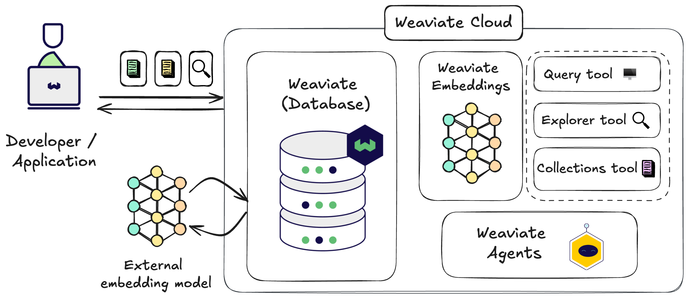

import WCDLandingIntro from '/_includes/wcs/wcs-landing-intro.mdx'

<WCDLandingIntro/>

:::tip Quickstart
Follow the **[quickstart guide](/docs/cloud/quickstart)** to get started with Weaviate Cloud.
:::

## Preview of a WCD workflow

<iframe id="zklm7wwtjr" src="https://app.guideflow.com/embed/zklm7wwtjr" width="100%" height="100%" style={{overflow:'hidden', position: 'absolute', border:'none'}} scrolling="no" allow="clipboard-read; clipboard-write" webkitallowfullscreen mozallowfullscreen allowfullscreen allowtransparency="true"></iframe>

## Weaviate Cloud and Weaviate Database

import WCDLandingOpenSource from '/_includes/wcs/wcs-landing-open-source.mdx'

<WCDLandingOpenSource/>

## Weaviate Cloud solutions

import WCDLandingSolutions from '/_includes/wcs/wcs-landing-solutions.mdx'

<WCDLandingSolutions/>

## Get started

import WCDLandingGetStarted from '/_includes/wcs/wcs-landing-get-started.mdx'

<WCDLandingGetStarted/>

## Support & feedback

import SupportAndTrouble from '/_includes/wcs/support-and-troubleshoot.mdx';

<SupportAndTrouble />

import CustomScriptLoader from '/src/components/scriptSwitch';

<CustomScriptLoader/>
