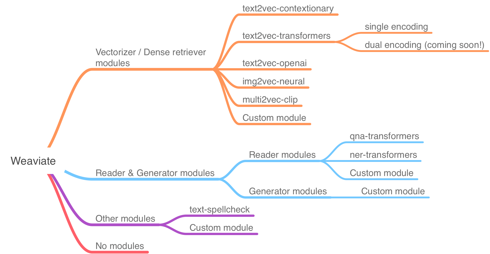

<!-- :::caution Migrated From:
- Combines theoretical explanations from `Configuration/Modules` + `Modules/Index`. e.g.:
  - `Introduction` is from `Configuration/Modules`
  - `Vectorization modules (Dense Retriever modules)` is from `Modules/Index`
::: -->

Weaviate has a modularized structure. Functionality such as vectorization or backups is handled by *optional* modules.

The core of Weaviate, without any modules attached, is a pure vector-native database.

Data is stored in Weaviate as the combination of an object and its vector, and these vectors are searchable by the provided [vector index algorithm](../concepts/indexing/vector-index.md). Without any vectorizer modules attached, Weaviate does not know how to *vectorize* an object, i.e. *how* to calculate the vectors given an object.

Depending on the type of data you want to store and search (text, images, etc.), and depending on the use case (like search, question answering, etc., depending on language, classification, ML model, training set, etc.), you can choose and attach a vectorizer module that best fits your use case. Or, you can "bring your own" vectors to Weaviate.

This page explains what modules are, and what purpose they serve in Weaviate.

## Available module types

This graphic displays the available modules for the latest Weaviate version (||site.weaviate_version||) . Modules are grouped into these categories:

- Vectorization modules
- Vectorization and additional functionality modules
- Other modules

### Vectorizer & Ranker modules

Vectorizer modules, like the `text2vec-*`, `multi2vec-*` or `img2vec-*` modules, transform data into vectors. Ranker modules, like the `rerank-*` modules, rank the results.

### Reader & Generator modules

Reader or Generator modules can be used on top of a Vectorizer module. These modules take the set of relevant documents that are retrieved, and performs another operation, such as question answering, or a generative task. An example Reader module is [`qna-transformers`](../modules/qna-transformers.md) module, which extracts an answer directly from a document. A Generator module would, on the other hand, use *language generation* to generate an answer from the given document.

### Other modules

These include those such as `gcs-backup` or `text-spellcheck`.

## Dependencies

Modules can be dependent on other modules to be present. For example, to use the [`qna-transformers`](../modules/qna-transformers.md) module, *exactly one* text vectorization module is required.

## Weaviate without modules

Weaviate can also be used without any modules, as pure vector native database and search engine. If you choose not to include any modules, you will need to enter a vector for each data entry. You can then search through the objects by a vector as well.

## Custom modules

It is possible for anyone to create a custom module for use with Weaviate. Click [here](../modules/custom-modules.md) to see how you can create and use your own modules.

## Further resources

:::info Related pages
- [Configuration: Modules](../configuration/modules.md)
- [References: Modules](../modules/index.md)
:::

## Questions and feedback

import DocsFeedback from '/_includes/docs-feedback.mdx';

<DocsFeedback/>
